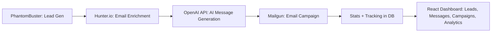

## Enhanced End-to-End Flow

### Backend

**Lead Generation (PhantomBuster)**
- Fetch leads from LinkedIn via PhantomBuster API.
- Store raw leads in the database: name, title, company, linkedin_url.
- _Enhancement:_ Validate and deduplicate leads before storing.

**Email Enrichment (Hunter.io)**
- For leads without email, call Hunter.io API.
- Append verified email + confidence score.
- Update lead record in database.
- _Enhancement:_ Add fallback logic if Hunter.io fails (optional for future).

**AI Message Generation (OpenAI API)**
- Use enriched lead details (name, company, role) to generate personalized outreach messages.
- Store message with lead in database.
- _Enhancement:_ Allow user to select tone/style; cache generated messages for reuse.

**Email Campaign (Mailgun)**
- Send AI-generated message to enriched email via Mailgun.
- Track status (sent, delivered, opened, replied, bounced).
- Log results in campaign tracking in the database.
- _Enhancement:_ Add retry logic for failed sends; support scheduling and follow-ups.

### Frontend (React Dashboard)

**Leads Tab**
- Shows imported + enriched leads.
- _Enhancement:_ Add filters (status, enrichment, campaign) and bulk actions.

**Messages Tab**
- Displays AI-generated messages before sending.
- _Enhancement:_ Allow editing messages before sending.

**Campaign Tab**
- Shows campaign stats (sent, opened, replied).
- _Enhancement:_ Visualize campaign performance over time.

**Analytics**
- Visualize enrichment success, delivery rates, engagement.
- _Enhancement:_ Add export options and custom date ranges.

**Settings**
- Configure API keys (PhantomBuster, Hunter.io, Mailgun, OpenAI).
- _Enhancement:_ Add validation and test connection buttons.

---

### Updated Workflow Diagram

---

**Removed unnecessary steps:**
- Manual CSV uploads (prefer API integration and bulk import).
- Redundant status tracking (combine logs and campaign stats).
- Unused enrichment sources (focus on Hunter.io, add fallback only if needed).

**Enhancements:**
- Deduplication, fallback enrichment, message caching, retry logic, advanced filters, message editing, export analytics, API key validation.

